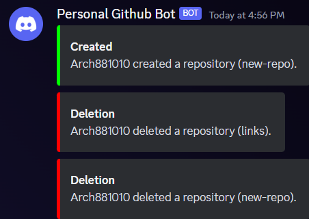

# Changelogs

## 1/2/2024 (1)

### By @Arch881010

- Created Change Logs.
- Put things in development into their own folder.
- Added a nickname area in bot.js under user object.
- Created .github folder
  - Added dependabot.yml (runs everyday at 2am UTC; Lets me find any bad dependancies)
- Added code of conduct (partial rewrote using template)
- Added contributing (rewrote using template)
  - The above two are mainly templates.
- Ran through a 'formatter'
- Create a function to get the info of the issue. Instead of long strings, it returns an object that you can get rid of.

## 1/5/2024 (2)

### By @Arch881010

- Created Webhooks
  - Trigger on repository deletion and creation.
- Fixed issues
  - Reading my own code, I noticed the bot COULD trigger if owner listed closed the issue of one they were NOT an invited collaborator. 
    - This means changing the trigger to the repository owner to fix.
- Formatted and properly cleaned up some parts of code.
- Left a good chunk of comments for increased readbility.
- Created functions to simplify further useage.
- Probably more that I've left off.

